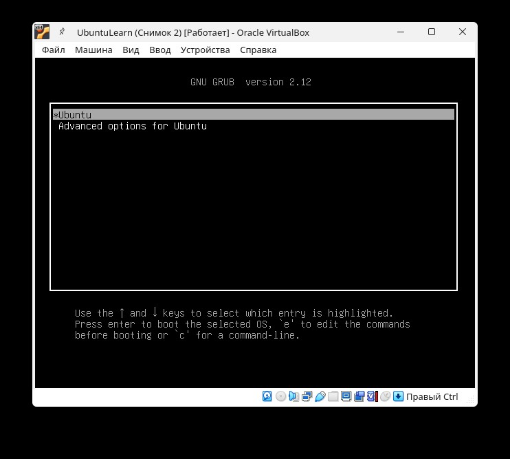
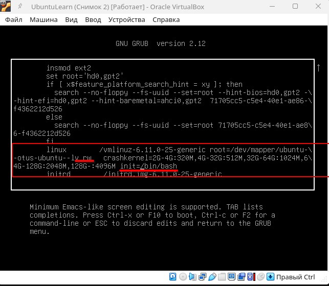
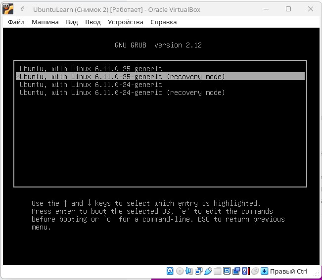
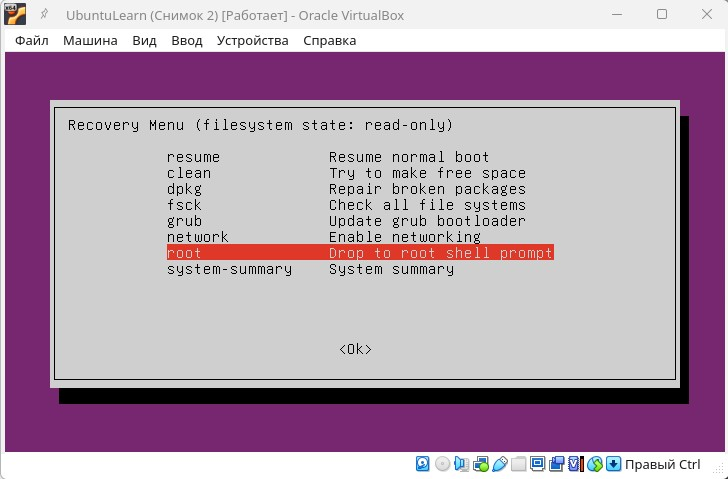

# Д.З. 8 Загрузка системы
1. Включить отображение меню Grub.
2. Попасть в систему без пароля несколькими способами.
3. Установить систему с LVM, после чего переименовать VG.

## 1. Включить отображение меню Grub

#### Редактирование файла конфигурации grub
Приводим файл к виду:

        GRUB_DEFAULT=0
        GRUB_TIMEOUT_STYLE=menu
        GRUB_TIMEOUT=10
        GRUB_DISTRIBUTOR=`( . /etc/os-release; echo ${NAME:-Ubuntu} ) 2>/dev/null || echo Ubuntu`
        GRUB_CMDLINE_LINUX_DEFAULT=""
        GRUB_CMDLINE_LINUX=""

так же расскоментируем строку

        #GRUB_DISABLE_RECOVERY="true"
и изменим ее сл. образом:

        GRUB_DISABLE_RECOVERY="false"

#### Обновление конфигурации файла загрузки и перезагрузка машины

        debugger@ubuntu-learn:~$ sudo update-grub
        Sourcing file `/etc/default/grub'
        Sourcing file `/etc/default/grub.d/kdump-tools.cfg'
        Generating grub configuration file ...
        Found linux image: /boot/vmlinuz-6.11.0-25-generic
        Found initrd image: /boot/initrd.img-6.11.0-25-generic
        Found linux image: /boot/vmlinuz-6.11.0-24-generic
        Found initrd image: /boot/initrd.img-6.11.0-24-generic
        Warning: os-prober will not be executed to detect other bootable partitions.
        Systems on them will not be added to the GRUB boot configuration.
        Check GRUB_DISABLE_OS_PROBER documentation entry.
        Adding boot menu entry for UEFI Firmware Settings ...
        done
        debugger@ubuntu-learn:~$ sudo reboot

#### После перезагрузки виден экран выбора вариантов загрузки

.

## 2. Попасть в систему без пароля несколькими способами.

####  2.1 - Редактирование menu grub при загрузке

При загрузке системы в меню grub на первом пункте нажимаем e - edit.
Меняем строчку параметров ядра Linux сл. образом

.

монтируем корневую систему в режиме записи - rw
и добавляем опцию init=/bin/bash - вместо системы инициализации запускаем bash
и сразу получаем доступ к оболочке на незапущеной системе.

Запускаемся с новыми параметрами, нажимаем ctrl+x.

####  2.2 - Использование Recovery mod

При загрузке системы в меню grub выбираем пункт Advanced options for Ubuntu
А затем необходимый вариант ядра с пометкой (Recovery mode)

.

И попадаем в меню восстановления (Recovery menu), где выбираем пункт

.

входим под root, если конечно же до этого пароль root не был уставнолен :)

## 3. Установить систему с LVM, после чего переименовать VG.

Посмотрим посмотрим информацию о текущенм состоянии volume groups

        oot@ubuntu-learn:~# vgs
        VG          #PV #LV #SN Attr   VSize  VFree
        ubuntu-vg     1   1   0 wz--n- 18,22g 10,22g

Переименуем volume group ubuntu-vg в ubuntu-learn

        root@ubuntu-learn:~# vgrename ubuntu-vg ubuntu-learn
        Volume group "ubuntu-vg successfully renamed to "ubuntu-learn"
        root@ubuntu-learn:~#
        root@ubuntu-learn:~# vgs
        VG           #PV #LV #SN Attr   VSize  VFree
        ubuntu-learn   1   1   0 wz--n- 18,22g 10,22g
        root@ubuntu-learn:~#

Изменяем grub.cfg для загрузки с корректной volume groups

        root@ubuntu-learn:~# sudo sed 's/ubuntu--vg/ubuntu--learn/g' /boot/grub/grub.cfg
        #
        # DO NOT EDIT THIS FILE
        #
        # It is automatically generated by grub-mkconfig using templates
        # from /etc/grub.d and settings from /etc/default/grub
        #

        ### BEGIN /etc/grub.d/00_header ###
        if [ -s $prefix/grubenv ]; then
        set have_grubenv=true
        load_env
        fi
        if [ "${initrdfail}" = 2 ]; then
        set initrdfail=
        elif [ "${initrdfail}" = 1 ]; then
        set next_entry="${prev_entry}"
        set prev_entry=
        save_env prev_entry
        if [ "${next_entry}" ]; then
            set initrdfail=2
        fi
        fi
        if [ "${next_entry}" ] ; then
        set default="${next_entry}"
        set next_entry=
        save_env next_entry
        set boot_once=true
        else
        set default="0"
        fi

        if [ x"${feature_menuentry_id}" = xy ]; then
        menuentry_id_option="--id"
        else
        menuentry_id_option=""
        fi

        export menuentry_id_option

        if [ "${prev_saved_entry}" ]; then
        set saved_entry="${prev_saved_entry}"
        save_env saved_entry
        set prev_saved_entry=
        save_env prev_saved_entry
        set boot_once=true
        fi

        function savedefault {
        if [ -z "${boot_once}" ]; then
            saved_entry="${chosen}"
            save_env saved_entry
        fi
        }
        function initrdfail {
            if [ -n "${have_grubenv}" ]; then if [ -n "${partuuid}" ]; then
            if [ -z "${initrdfail}" ]; then
                set initrdfail=1
                if [ -n "${boot_once}" ]; then
                set prev_entry="${default}"
                save_env prev_entry
                fi
            fi
            save_env initrdfail
            fi; fi
        }
        function recordfail {
        set recordfail=1
        if [ -n "${have_grubenv}" ]; then if [ -z "${boot_once}" ]; then save_env recordfail; fi; fi
        }
        function load_video {
        if [ x$feature_all_video_module = xy ]; then
            insmod all_video
        else
            insmod efi_gop
            insmod efi_uga
            insmod ieee1275_fb
            insmod vbe
            insmod vga
            insmod video_bochs
            insmod video_cirrus
        fi
        }

        if [ x$feature_default_font_path = xy ] ; then
        font=unicode
        else
        insmod part_gpt
        insmod lvm
        insmod ext2
        set root='lvmid/wI1rMS-Epoz-nIgp-DzTu-7kbE-qkMe-hKzOtV/Hi2lZU-sTMj-xONI-dwag-QsYe-S2ED-jXSU0f'
        if [ x$feature_platform_search_hint = xy ]; then
        search --no-floppy --fs-uuid --set=root --hint='lvmid/wI1rMS-Epoz-nIgp-DzTu-7kbE-qkMe-hKzOtV/Hi2lZU-sTMj-xONI-dwag-QsYe-S2ED-jXSU0f'  539698c9-7f1b-460e-afa3-016d2b50716c
        else
        search --no-floppy --fs-uuid --set=root 539698c9-7f1b-460e-afa3-016d2b50716c
        fi
            font="/usr/share/grub/unicode.pf2"
        fi

        if loadfont $font ; then
        set gfxmode=auto
        load_video
        insmod gfxterm
        set locale_dir=$prefix/locale
        set lang=ru_RU
        insmod gettext
        fi
        terminal_output gfxterm
        if [ "${recordfail}" = 1 ] ; then
        set timeout=30
        else
        if [ x$feature_timeout_style = xy ] ; then
            set timeout_style=menu
            set timeout=10
        # Fallback normal timeout code in case the timeout_style feature is
        # unavailable.
        else
            set timeout=10
        fi
        fi
        ### END /etc/grub.d/00_header ###

        ### BEGIN /etc/grub.d/05_debian_theme ###
        set menu_color_normal=white/black
        set menu_color_highlight=black/light-gray
        ### END /etc/grub.d/05_debian_theme ###

        ### BEGIN /etc/grub.d/10_linux ###
        function gfxmode {
                set gfxpayload="${1}"
                if [ "${1}" = "keep" ]; then
                        set vt_handoff=vt.handoff=7
                else
                        set vt_handoff=
                fi
        }
        if [ "${recordfail}" != 1 ]; then
        if [ -e ${prefix}/gfxblacklist.txt ]; then
            if [ ${grub_platform} != pc ]; then
            set linux_gfx_mode=keep
            elif hwmatch ${prefix}/gfxblacklist.txt 3; then
            if [ ${match} = 0 ]; then
                set linux_gfx_mode=keep
            else
                set linux_gfx_mode=text
            fi
            else
            set linux_gfx_mode=text
            fi
        else
            set linux_gfx_mode=keep
        fi
        else
        set linux_gfx_mode=text
        fi
        export linux_gfx_mode
        menuentry 'Ubuntu' --class ubuntu --class gnu-linux --class gnu --class os $menuentry_id_option 'gnulinux-simple-539698c9-7f1b-460e-afa3-016d2b50716c' {
                recordfail
                load_video
                gfxmode $linux_gfx_mode
                insmod gzio
                if [ x$grub_platform = xxen ]; then insmod xzio; insmod lzopio; fi
                insmod part_gpt
                insmod ext2
                set root='hd0,gpt2'
                if [ x$feature_platform_search_hint = xy ]; then
                search --no-floppy --fs-uuid --set=root --hint-bios=hd0,gpt2 --hint-efi=hd0,gpt2 --hint-baremetal=ahci0,gpt2  71705cc5-c5e4-40e1-ae86-f4362212d526
                else
                search --no-floppy --fs-uuid --set=root 71705cc5-c5e4-40e1-ae86-f4362212d526
                fi
                linux   /vmlinuz-6.11.0-25-generic root=/dev/mapper/ubuntu--learn-ubuntu--lv ro   crashkernel=2G-4G:320M,4G-32G:512M,32G-64G:1024M,64G-128G:2048M,128G-:4096M
                initrd  /initrd.img-6.11.0-25-generic
        }
        submenu 'Advanced options for Ubuntu' $menuentry_id_option 'gnulinux-advanced-539698c9-7f1b-460e-afa3-016d2b50716c' {
                menuentry 'Ubuntu, with Linux 6.11.0-25-generic' --class ubuntu --class gnu-linux --class gnu --class os $menuentry_id_option 'gnulinux-6.11.0-25-generic-advanced-539698c9-7f1b-460e-afa3-016d2b50716c' {
                        recordfail
                        load_video
                        gfxmode $linux_gfx_mode
                        insmod gzio
                        if [ x$grub_platform = xxen ]; then insmod xzio; insmod lzopio; fi
                        insmod part_gpt
                        insmod ext2
                        set root='hd0,gpt2'
                        if [ x$feature_platform_search_hint = xy ]; then
                        search --no-floppy --fs-uuid --set=root --hint-bios=hd0,gpt2 --hint-efi=hd0,gpt2 --hint-baremetal=ahci0,gpt2  71705cc5-c5e4-40e1-ae86-f4362212d526
                        else
                        search --no-floppy --fs-uuid --set=root 71705cc5-c5e4-40e1-ae86-f4362212d526
                        fi
                        echo    'Loading Linux 6.11.0-25-generic ...'
                        linux   /vmlinuz-6.11.0-25-generic root=/dev/mapper/ubuntu--learn-ubuntu--lv ro   crashkernel=2G-4G:320M,4G-32G:512M,32G-64G:1024M,64G-128G:2048M,128G-:4096M
                        echo    'Loading initial ramdisk ...'
                        initrd  /initrd.img-6.11.0-25-generic
                }
                menuentry 'Ubuntu, with Linux 6.11.0-25-generic (recovery mode)' --class ubuntu --class gnu-linux --class gnu --class os $menuentry_id_option 'gnulinux-6.11.0-25-generic-recovery-539698c9-7f1b-460e-afa3-016d2b50716c' {
                        recordfail
                        load_video
                        insmod gzio
                        if [ x$grub_platform = xxen ]; then insmod xzio; insmod lzopio; fi
                        insmod part_gpt
                        insmod ext2
                        set root='hd0,gpt2'
                        if [ x$feature_platform_search_hint = xy ]; then
                        search --no-floppy --fs-uuid --set=root --hint-bios=hd0,gpt2 --hint-efi=hd0,gpt2 --hint-baremetal=ahci0,gpt2  71705cc5-c5e4-40e1-ae86-f4362212d526
                        else
                        search --no-floppy --fs-uuid --set=root 71705cc5-c5e4-40e1-ae86-f4362212d526
                        fi
                        echo    'Loading Linux 6.11.0-25-generic ...'
                        linux   /vmlinuz-6.11.0-25-generic root=/dev/mapper/ubuntu--learn-ubuntu--lv ro recovery nomodeset dis_ucode_ldr
                        echo    'Loading initial ramdisk ...'
                        initrd  /initrd.img-6.11.0-25-generic
                }
                menuentry 'Ubuntu, with Linux 6.11.0-24-generic' --class ubuntu --class gnu-linux --class gnu --class os $menuentry_id_option 'gnulinux-6.11.0-24-generic-advanced-539698c9-7f1b-460e-afa3-016d2b50716c' {
                        recordfail
                        load_video
                        gfxmode $linux_gfx_mode
                        insmod gzio
                        if [ x$grub_platform = xxen ]; then insmod xzio; insmod lzopio; fi
                        insmod part_gpt
                        insmod ext2
                        set root='hd0,gpt2'
                        if [ x$feature_platform_search_hint = xy ]; then
                        search --no-floppy --fs-uuid --set=root --hint-bios=hd0,gpt2 --hint-efi=hd0,gpt2 --hint-baremetal=ahci0,gpt2  71705cc5-c5e4-40e1-ae86-f4362212d526
                        else
                        search --no-floppy --fs-uuid --set=root 71705cc5-c5e4-40e1-ae86-f4362212d526
                        fi
                        echo    'Loading Linux 6.11.0-24-generic ...'
                        linux   /vmlinuz-6.11.0-24-generic root=/dev/mapper/ubuntu--learn-ubuntu--lv ro   crashkernel=2G-4G:320M,4G-32G:512M,32G-64G:1024M,64G-128G:2048M,128G-:4096M
                        echo    'Loading initial ramdisk ...'
                        initrd  /initrd.img-6.11.0-24-generic
                }
                menuentry 'Ubuntu, with Linux 6.11.0-24-generic (recovery mode)' --class ubuntu --class gnu-linux --class gnu --class os $menuentry_id_option 'gnulinux-6.11.0-24-generic-recovery-539698c9-7f1b-460e-afa3-016d2b50716c' {
                        recordfail
                        load_video
                        insmod gzio
                        if [ x$grub_platform = xxen ]; then insmod xzio; insmod lzopio; fi
                        insmod part_gpt
                        insmod ext2
                        set root='hd0,gpt2'
                        if [ x$feature_platform_search_hint = xy ]; then
                        search --no-floppy --fs-uuid --set=root --hint-bios=hd0,gpt2 --hint-efi=hd0,gpt2 --hint-baremetal=ahci0,gpt2  71705cc5-c5e4-40e1-ae86-f4362212d526
                        else
                        search --no-floppy --fs-uuid --set=root 71705cc5-c5e4-40e1-ae86-f4362212d526
                        fi
                        echo    'Loading Linux 6.11.0-24-generic ...'
                        linux   /vmlinuz-6.11.0-24-generic root=/dev/mapper/ubuntu--learn-ubuntu--lv ro recovery nomodeset dis_ucode_ldr
                        echo    'Loading initial ramdisk ...'
                        initrd  /initrd.img-6.11.0-24-generic
                }
        }

        ### END /etc/grub.d/10_linux ###

        ### BEGIN /etc/grub.d/10_linux_zfs ###
        ### END /etc/grub.d/10_linux_zfs ###

        ### BEGIN /etc/grub.d/20_linux_xen ###

        ### END /etc/grub.d/20_linux_xen ###

        ### BEGIN /etc/grub.d/25_bli ###
        if [ "$grub_platform" = "efi" ]; then
        insmod bli
        fi
        ### END /etc/grub.d/25_bli ###

        ### BEGIN /etc/grub.d/30_os-prober ###
        ### END /etc/grub.d/30_os-prober ###

        ### BEGIN /etc/grub.d/30_uefi-firmware ###
        if [ "$grub_platform" = "efi" ]; then
                fwsetup --is-supported
                if [ "$?" = 0 ]; then
                        menuentry 'UEFI Firmware Settings' $menuentry_id_option 'uefi-firmware' {
                                fwsetup
                        }
                fi
        fi
        ### END /etc/grub.d/30_uefi-firmware ###

        ### BEGIN /etc/grub.d/35_fwupd ###
        ### END /etc/grub.d/35_fwupd ###

        ### BEGIN /etc/grub.d/40_custom ###
        # This file provides an easy way to add custom menu entries.  Simply type the
        # menu entries you want to add after this comment.  Be careful not to change
        # the 'exec tail' line above.
        ### END /etc/grub.d/40_custom ###

        ### BEGIN /etc/grub.d/41_custom ###
        if [ -f  ${config_directory}/custom.cfg ]; then
        source ${config_directory}/custom.cfg
        elif [ -z "${config_directory}" -a -f  $prefix/custom.cfg ]; then
        source $prefix/custom.cfg
        fi
        ### END /etc/grub.d/41_custom ###
        root@ubuntu-learn:~#

Перезагружаемся.

